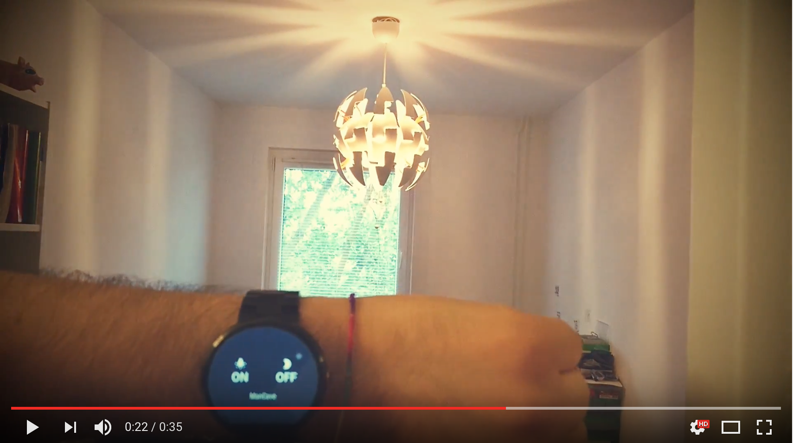

# nodejs-iot-home-control

**TL:DR**

Controlling sub GHz (433 MHz) electronic switches in the house with mobile &amp; wearable app.

**Other project parts**

Android part of the project [**repo**](https://github.com/bernardpletikosa/android-iot-home-control)
Hardware part coming soon

**Showcase video**

